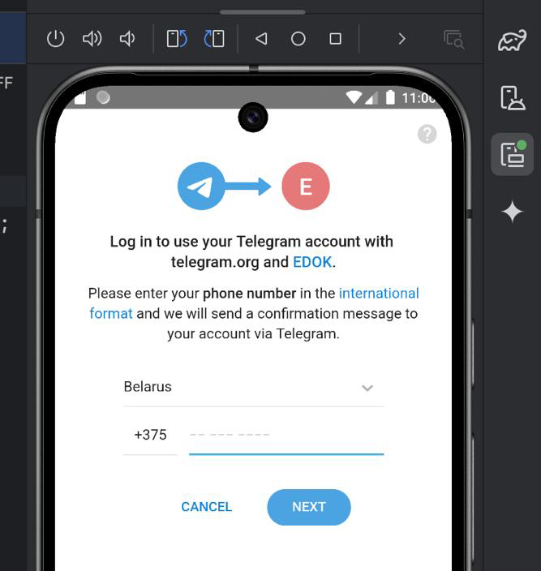
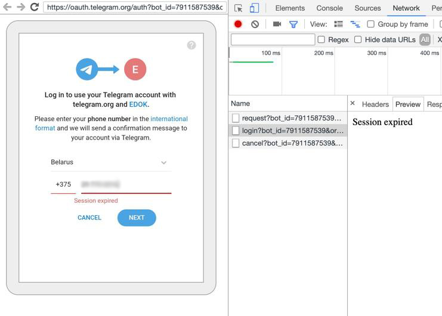
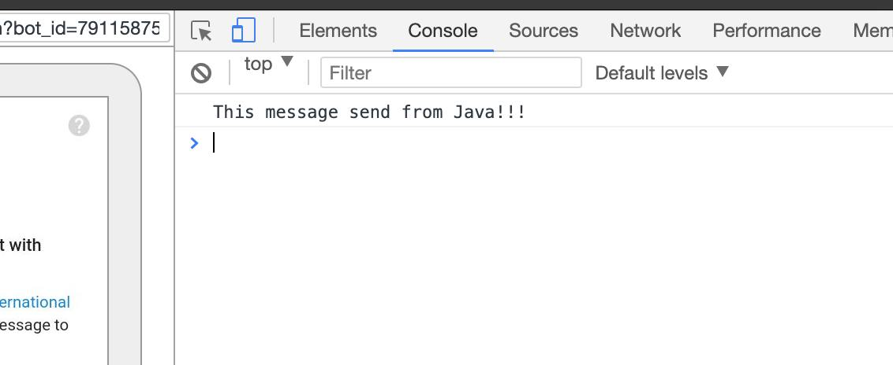
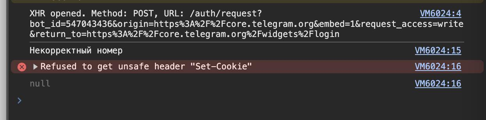

# React Native Telegram Login

#### THIS IS AN EXPERIMENTAL PROJECT THAT DIDN'T WORK! 😭

### [🇷🇺 Читать на русском](/README_RU.md)

<p align="center">
  
</p>

## How I did Telegram login and why it doesn't work.....

On a project I'm doing a React Native app for Android and iOS.

The customer wanted to do one-click authorization in the app via Telegram.

Telegram doesn't use OAuth, it has no API and no ready SDK.

We only have a widget at our disposal. Its documentation can be found here:

https://core.telegram.org/widgets/login

I decided to simulate processing the widget natively via Android WebView.

This is the only way I know of to process pages that the user interacts with.

Here's what I did:

1. Created a bot to authorize via [@BotFather](https://t.me/BotFather) with the `/newbot` command
2. Set the bot's domain from which authorization should be performed with the command `/setdomain`

For tests I set the domain of Telegram itself https://telegram.org.

This domain is displayed on the login page, along with the name of your bot.

Also, this domain must correspond to the specified CGI parameter origin in the link.

3. Created a WebView handler in Java using [React Native bridge](https://www.geeksforgeeks.org/what-is-a-bridge-in-react-native/).

You can see the WebView handler here: [click](https://github.com/MakStashkevich/react-native-telegram-login/blob/main/android/src/main/java/com/makstashkevich/telegramlogin/internal/WebViewLoginActivity.java#L270)

```java
private class WebViewClient extends android.webkit.WebViewClient {
    // ...
}
```

**4. And this is where I find out that... Cookies don't work!**

WebView has a strange system of working with cookies, no matter how I tried to enable them natively, nothing worked.

The thing is that Telegram checks for Cookie: `stel_ln` when loading the authorization page and any authorization requests.

If it is not present, it sends a Response Header Set-Cookie with the actual key.

But we can't get Response requests through WebView.

5. On the internet people write “you need to use `shouldInterceptRequest()` to intercept requests”

Ok, I did as they said.

```java
@SuppressLint("NewApi")
@Override
public WebResourceResponse shouldInterceptRequest(WebView view, WebResourceRequest request) {
  if (request != null && request.getUrl() != null && request.getUrl().toString().contains("telegram.org")) {
    String scheme = request.getUrl().getScheme().trim();
    if (scheme.equalsIgnoreCase("http") || scheme.equalsIgnoreCase("https")) {
      // Here's the request handler
      return executeRequest(request);
    }
  }
  return super.shouldInterceptRequest(view, request);
}
```

At the moment when the request was sent - I intercept it and simulate the request again to get the “Set-Cookie” I need.

```java
OkHttpClient okHttpClient = new OkHttpClient();
final Call call = okHttpClient.newCall(new Request.Builder()
  .url(request.getUrl().toString())
  .method(request.getMethod(), request.getMethod().equalsIgnoreCase("POST") ? RequestBody.create(null, new byte[0]) : null)
  .headers(Headers.of(request.getRequestHeaders()))
  .build()
);
try {
  final Response response = call.execute();
  // ...
}
```

This should work...

And in most projects, it would produce a result...

But.

6. The necessary keys `stel_ln`, `stel_ssid` and others **_confused_** with the ones I received by simulating the request.

Telegram considered it no longer relevant and sent a `“Session expired”` error.

.

What should I do about it?

**7. Last hope - make a bicycle.**



It was decided to embed the javascript code in the WebView page being loaded and override `XMLHttpRequest.prototype.open`

To then intercept the request and its response.

You can do this using the function:

```java
String js = "(function() { console.log('This message send from Java!!!'); return 'Hello!' })();";
webView.evaluateJavascript(js, new ValueCallback<String>() {
  @TargetApi(Build.VERSION_CODES.HONEYCOMB)
  @Override
  public void onReceiveValue(String s) {
    // Shows the result of the executed javascript
    // "Hello!"
    Log.d("TAG", s);
  }
});
```

As it turns out, you can't get very far on a bike like that.

I was met on the road..

8. Error: `Refused to get unsafe header “Set-Cookie”`



As it turns out, you can't read a forbidden or as it says above, “unsafe header” with our favorite cookies.

Whatever manipulations you do, the browser won't let you read them.

I checked.

---

You can run my project and see how it works.

# React Native example:

```typescript jsx
import React from 'react';
import {View, Button} from 'react-native';
import {getTelegramUserInfo} from 'react-native-telegram-login';

export const TelegramLoginButton = () => {
  async function onTelegramLogin() {
    // To open WebView via Telegram OAuth
    await telegramLogin();
    // Or... open and retrieve user data
    const userInfo = await getTelegramUserInfo();
    console.log({userInfo});
  }

  return (
    <View style={{margin: 10}}>
      <Button color="blue" title="Telegram Login" onPress={onTelegramLogin}/>
    </View>
  );
};
````
